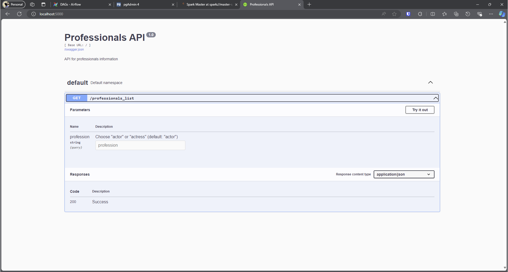

# IMDb ETL Project

This project is an end-to-end data pipeline designed to extract, transform, and load [IMDb](https://developer.imdb.com/non-commercial-datasets/) data to derive valuable insights. The system utilizes Apache Airflow for orchestration, Apache Spark for data processing, PostgreSQL for storing the results, and a REST API for retrieving valuable information.

## Table of Contents
- [IMDb ETL Project](#imdb-etl-project)
  - [Table of Contents](#table-of-contents)
  - [Project Overview](#project-overview)
  - [Architecture](#architecture)
  - [Data Pipeline](#data-pipeline)
    - [ETL Tasks](#etl-tasks)
  - [Database Schema](#database-schema)
    - [SQL Statements](#sql-statements)
  - [REST API](#rest-api)
    - [Endpoints](#endpoints)
  - [Setup Instructions](#setup-instructions)
    - [Prerequisites](#prerequisites)
    - [Steps](#steps)
  - [Usage](#usage)
    - [Trigger the ETL Workflow](#trigger-the-etl-workflow)
    - [Query the API](#query-the-api)

## Project Overview

The project aims to process IMDb data files to generate a list of actors and actresses ordered by their rating score (calculated as the average rating of movies they participated in).
Each item in the list includes:
- Name
- Score
- Number of Titles as Principal (with the input profession) - actor or actress
- Total runtime minutes (in titles they participated as the input profession)

## Architecture

The architecture consists of the following components:
- **Apache Airflow**: Orchestrating (ingestion and cleansing).
- **Apache Spark**: Data processing and transformation.
- **PostgreSQL**: Database.
- **REST API**: Built with Flask and Gunicorn.

## Data Pipeline

1. **Ingestion**
   - Source: IMDb datasets
   - Method: Download files into RAW zone
2. **Transformation and Loading**
   - Cleaning: Simple transformations, Convert to correct Datatypes
3. **Refresh View**


### ETL Tasks

```
./ETL/task
          /ingestion/
            request_ingestion.py
          /cleansing/
            clean_task.py
                    /imdb/
                      clean_imdb.py
                        /data_assets/
                          clean_<data_assets>.py
                          ...
                    
```
The ETL folder is organized in different tasks being runned by airflow.

## Database Schema

The database consists of four main tables and one materialized view all inside one schema - **imdb**:
- **imdb.title.basics**: Contains basic information about movies
- **imdb.title.principals**: Contains data on the main cast of movies
- **imdb.title.ratings**: Contains movie ratings
- **imdb.name.basics**: Contains information about actors/actresses
- **imdb.actor_movie_details**: Join of the tables

### SQL Statements

```sql
    CREATE SCHEMA imdb;

    
    CREATE TABLE imdb.title_basics (
        tconst VARCHAR(255) PRIMARY KEY,
        titleType text,
        primaryTitle text,
        originalTitle text,
        isAdult BOOLEAN,
        startYear INT,
        endYear INT,
        runtimeMinutes INT,
        genres text
    );


    CREATE TABLE imdb.title_principals (
        tconst VARCHAR(255),
        ordering INT,
        nconst VARCHAR(255),
        category text,
        job text,
        characters text
    );

    
    CREATE TABLE imdb.title_ratings (
        tconst VARCHAR(255) PRIMARY KEY,
        averageRating FLOAT,
        numVotes INT
    );

    
    CREATE TABLE imdb.name_basics (
        nconst VARCHAR(255),
        primaryName text,
        birthYear INT,
        deathYear INT,
        primaryProfession text,
        tconst VARCHAR(255)
    );

    CREATE MATERIALIZED VIEW imdb.actor_movie_details AS
        WITH tb_tr AS (
            SELECT tb.tconst, tb.runtimeminutes, tr.averagerating
            FROM imdb.title_basics AS tb
            INNER JOIN imdb.title_ratings AS tr ON tb.tconst = tr.tconst
            WHERE tb.runtimeminutes IS NOT NULL
        ), nb_tp AS (
            SELECT DISTINCT nb.primaryname AS name, nb.tconst, category
            FROM imdb.name_basics AS nb
            INNER JOIN imdb.title_principals AS tp ON (nb.tconst = tp.tconst AND nb.nconst = tp.nconst)
            WHERE (tp.category IN ('actor', 'actress'))
        )
        SELECT nb_tp.name, nb_tp.tconst, nb_tp.category, tb_tr.runtimeminutes, tb_tr.averagerating
        FROM nb_tp
        INNER JOIN tb_tr ON tb_tr.tconst = nb_tp.tconst;
```

## REST API

### Endpoints
- **/professionals_list**: Returns the list of actors/actresses ordered by their rating score.
  - parameters: actor or actress

## Setup Instructions

### Prerequisites
- Docker
- Docker Compose

### Steps
1. Clone the repository
2. Start the services using Docker Compose (it is going to take a while to run):
    ```sh
    docker-compose up --build -d
    ```
3. Access the Airflow UI:
    - http://localhost:8080
    
4. Access pgAdmin UI 
      - UI to inspect PostgreSQL DB:  
        - user - admin@deus.com; pass - admin
        - HOST name - postgres; User - admin, Pass - admin
      - http://localhost:16543/ 
    
    
    
    
5. Access Spark Master UI
    - http://localhost:8081/ 
    
6. Access the swagger docs for the REST API
   - http://localhost:5000/
    

## Usage

### Trigger the ETL Workflow
1. Go to the Airflow UI
2. Trigger the DAG **IMDB_ETL** (it will take some time 30-40 minutes)

### Query the API
**IMPORTANT** -- Don't trigger the API through the swagger docs page. It will crash because of the amount of data.

1. http://localhost:5000/professionals_list?profession=actor
2. http://localhost:5000/professionals_list?profession=actress

